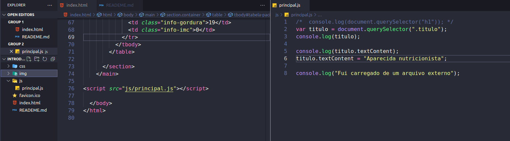
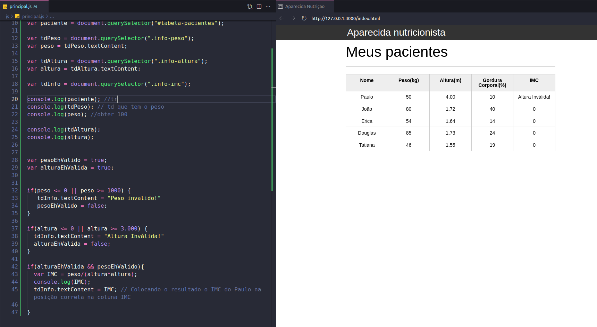
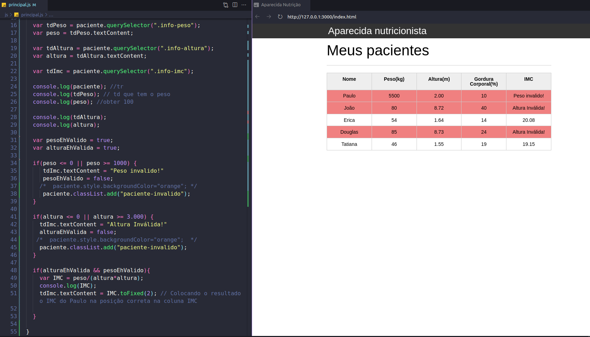
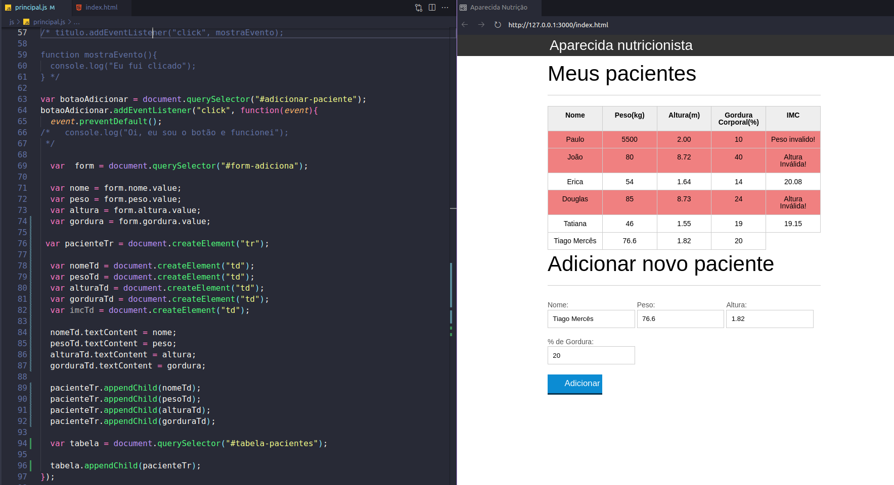
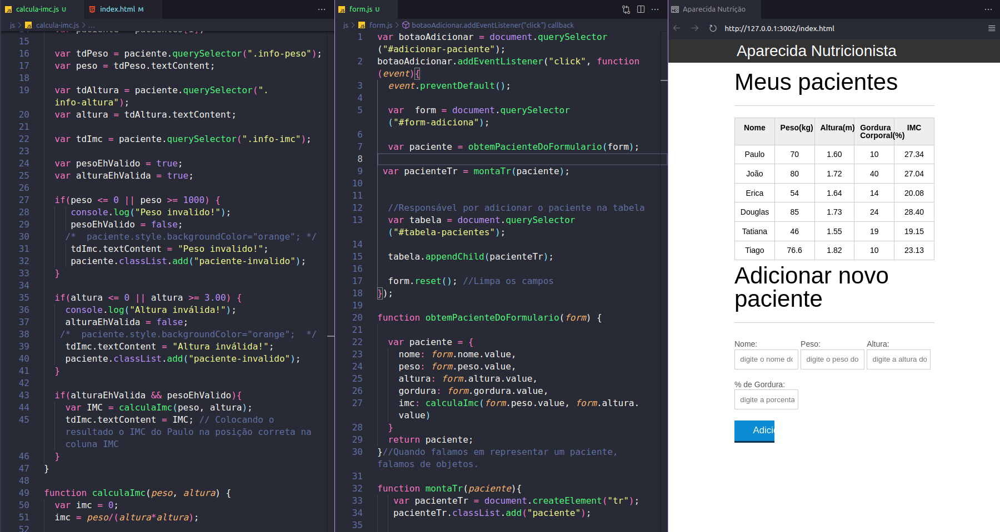
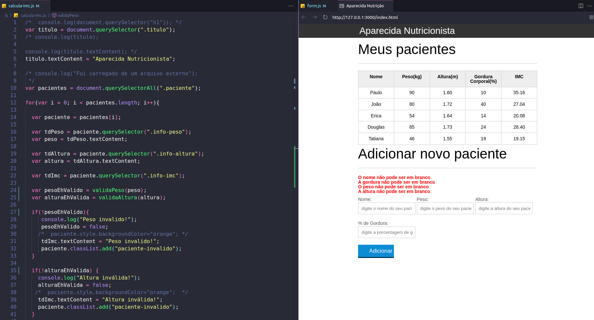
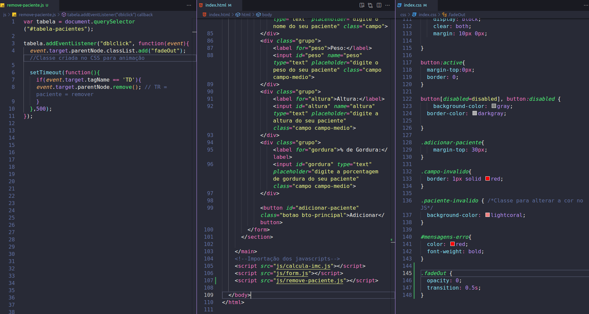

# Java Script: programando na linguagem da web 

GitHub Pages:
[Clique aqui!](https://tiagomerc.github.io/Java-Script-programando-na-linguagem-da-web-/)

### Introdução

**Apesar deste capítulo inicial ter sido curto, aprendemos pontos importantes como:**

- Separar a organização de nosso código em arquivos .js

- Importar arquivos .js sempre ao final do body

- A representação do HTML pela variável document

- A função que faz busca querySelector()

- Preferir selecionar por #id ou .classe

- No próximo avançaremos mais em nossos conhecimentos de Javascript.

### Variáveis e Operadores

Chegamos ao fim de mais um capítulo, e neste aqui utilizamos um pouco da lógica de programação e das funções do Javascript para validar nosso primeiro paciente.

Neste capítulo vimos:

 - O operador lógico de OU ( || )

 - O operador lógico de E ( && )

 - Busca de elementos

 

 ### 03. Arrays, Loop e Estilos

 Neste capítulo aprendemos a lidar uma coleção de elementos do HTML e vimos:

- Como selecionar diversos elementos com a função querySelectorAll()

- Relembramos um método clássico de iteração com o for

- Vimos como manipular estilos com a propriedade .style

- Vimos que devemos utilizar camelCase quando queremos modificar uma propriedade que tenha duas palavras, como a background-color

- A boa prática de não alterar o estilo diretamente no Javascript e sim modificar as classes dos elementos com a propriedade .classList

 

 ### 04. Eventos, Formulários e Criando Elementos 

 Neste capítulo implementamos a criação de usuários a partir de um formulário, e com isso aprendemos:

- A diferença entre as funções nomeadas e as funções anônimas

- A escutar eventos do browser com a função **addEventListener()**
Que a função criadora de elementos é **.createElement()**

- A pegar o valor de um input por meio da propriedade **.value**

- A acessar os input de um form por meio da propriedade **.name**

- A adicionar elementos na página e dentro de outros elementos com a função **appendChild()**

 

 ### 05. Boas Práticas com JavaScript 

Neste capítulo vimos

- Dividir o código, separando por funcionalidades do sistema

- Os objetos em Javascript

- A quebrar funções grandes em funções menores ,com cada uma com sua responsabilidade

- A função **form.reset()** para limpar o formulário

 

 ### 06. Validação de Formulários

Neste capítulo vimos:

- Mais organização de código, exportando as funções de validação.

- O operador de negação NOT (!)

- Como validar um formulário

- A função **push** para colocar elementos dentro de um array

- A propriedade **innerHTML** dos elementos, que foi usada para apagar os itens da **<ul>**

- O método forEach para percorrer arrays

### 07. Remoção, Delegação e Animação

Neste capítulo aprendemos:

- O novo evento de **dblclick**

- Como os eventos propagam atráves da página

- A delegação de eventos

- Como animar uma remoção com o **setTimeout**

